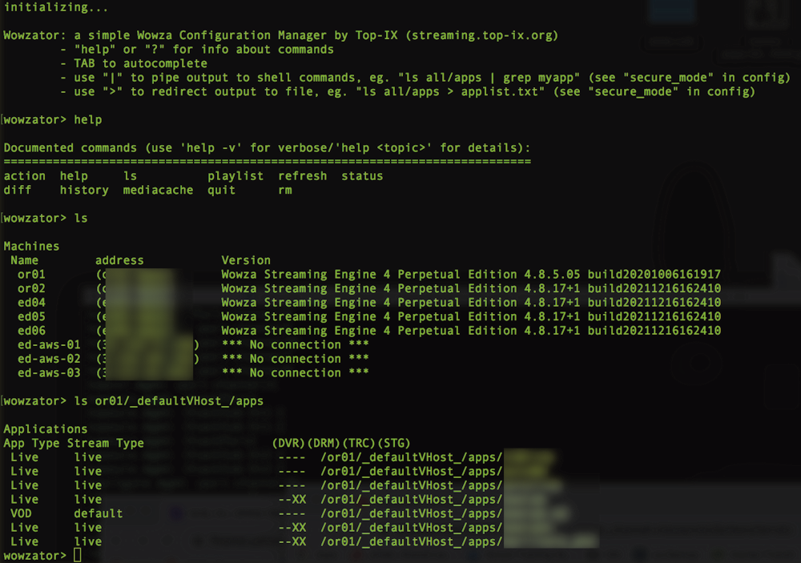

# wowzator
### A Configuration Manager for Wowza Streaming Engine

This tool is an interactive commandline Configuration Manager, it has been created to help in keeping the Wowza configuration aligned across multiple servers.

This tool uses a shell-like syntax to list and compare configuration information about vhosts, applications, smil files, transcoding templates, mediacache items and other parameters.

Basic actions are implemented:

	action <restart|stop|start> <server|vhost>

Basic status information is returned by the `status` command and `mediacache` command:

	status incomingstreams <server_name> [app_name_filter]
	status streamtargets <server_name> [app_name_filter]
	mediacache ls [all|server_name]

Wowzator has no database, it just lazy-fetches configuration information through the Wowza REST APIs to show and compare configuration info.

### Cheat sheet (TAB is your friend)
Show all servers and their Wowza version

	ls
	
Show all Wowza applications across all servers

	ls all/apps
	
Show all Wowza licenses

	ls all/licenses
	
Difference in application configuration between two servers

	diff srv_1/_defaultVHost_/apps srv_2

Difference in SMIL files between two servers

	diff srv_1/_defaultVHost_/smil srv_2

Differences between properties on two servers

	diff srv_1/_defaultVHost_/configuration srv_2
	
Wowza mediacache status on all servers

	mediacache ls
	
Flush a single mediacache file on a specific server

	mediacache flush srv_1/_defaultVHost_/<mediacache_item>

### Installation
	pip install -r requirements.txt

Create config.json file in the same dir of wowzator executable

Example:

	{
        	"secure_mode": "true",
        	"servers": [
			{
				"name": "or01",
				"address": "10.0.0.99",
				"user": "admin",
				"pw": "mysecret",
				"auth": "digest"
			},
			{
				[details of other server(s)...]
			}
		]
	}

Setting "secure_mode" to "false" enables redirection to file and piping of output (eg. "`ls all/apps > application_list.txt`" or "`ls all/apps | grep myapp`").

Note about the "auth" configuration parameter: Wowza after 4.8.5 uses basic authentication while Wowza 4.8.5 and earlier uses digest!!

  
